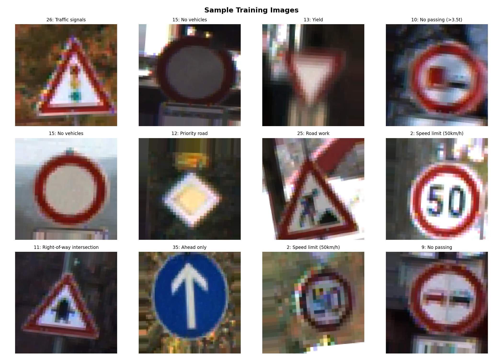
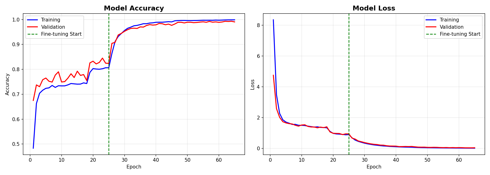
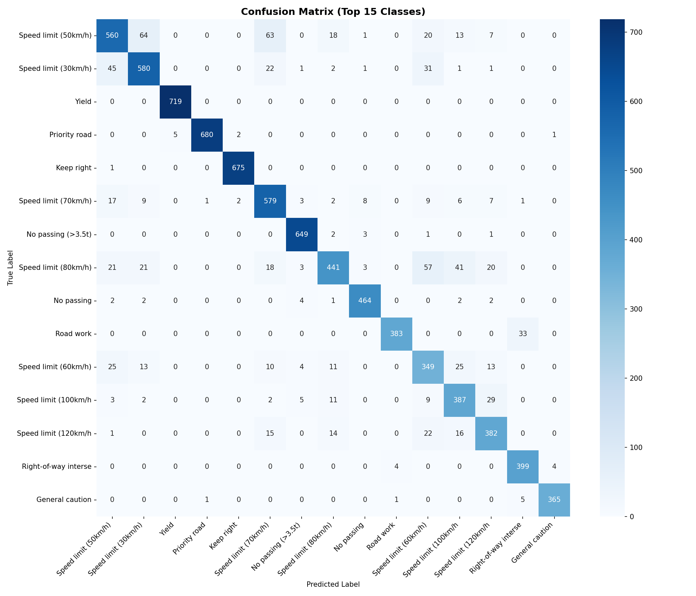

# Traffic Signs Recognition

This is my attempt to tackle traffic signs classification problem with a convolutional neural network implemented in TensorFlow (reaching **87.79% accuracy**). The highlights of this solution would be the use of transfer learning with EfficientNetB0, data augmentation, and two-phase training with fine-tuning.

This project is adapted from [alexstaravoitau/traffic-signs](https://github.com/alexstaravoitau/traffic-signs) and updated to use modern deep learning techniques.

## Dataset

Classification of German traffic signs using the [GTSRB dataset](https://sid.erda.dk/public/archives/daaeac0d7ce1152aea9b61d9f1e19370/published-archive.html).

The German Traffic Sign Dataset consists of:
- **39,209** 32×32 px color images for training
- **12,630** images for testing
- **43 classes** of traffic sign types

Each image is a photo of a traffic sign belonging to one of 43 classes, e.g. traffic sign types.

<p align="center">
  
</p>

## Approach

### Data Augmentation

The amount of data we have is not sufficient for a model to generalise well. It is also fairly unbalanced, and some classes are represented to significantly lower extent than the others. To address this, I applied data augmentation:

- **Rotation**: ±12 degrees
- **Zoom**: ±12%
- **Shift**: ±8% (width and height)
- **Brightness**: 90-110%

Note: Horizontal flipping is not used as traffic signs are directional.

### Transfer Learning

Instead of training a CNN from scratch, I used **EfficientNetB0** pre-trained on ImageNet as the base model. This approach leverages features learned from millions of images.

### Two-Phase Training

1. **Phase 1 - Feature Extraction**: Train only the classification head while keeping EfficientNetB0 frozen (25 epochs)
2. **Phase 2 - Fine-Tuning**: Unfreeze the top 50 layers of EfficientNetB0 and train with a lower learning rate (40 epochs)

### Class Weighting

To handle class imbalance, I computed class weights inversely proportional to class frequencies. This gives higher weight to underrepresented classes during training.

## Model Architecture

```
Input (128×128×3)
    ↓
EfficientNetB0 (pre-trained on ImageNet)
    ↓
GlobalAveragePooling2D
    ↓
Dense (512) + BatchNorm + Dropout (0.5)
    ↓
Dense (256) + BatchNorm + Dropout (0.4)
    ↓
Dense (43, softmax)
```

## Results

| Metric | Score |
|--------|-------|
| **Accuracy** | 87.79% |
| **Precision** | 88.10% |
| **Recall** | 87.79% |
| **F1 Score** | 87.74% |
| **Loss** | 0.5240 |

<p align="center">
  
</p>

<p align="center">
  
</p>

## Requirements

- Python 3.10
- TensorFlow 2.10
- NumPy
- Pandas
- Matplotlib
- Seaborn
- Scikit-learn
- Pillow

## Installation

```bash
pip install tensorflow==2.10.0 numpy pandas matplotlib seaborn scikit-learn pillow
```

## Usage

1. Download the GTSRB dataset from [here](https://sid.erda.dk/public/archives/daaeac0d7ce1152aea9b61d9f1e19370/published-archive.html)

2. Place the following files in the project folder:
   - `GTSRB_Final_Training_Images.zip`
   - `GTSRB_Final_Test_Images.zip`
   - `GTSRB_Final_Test_GT.zip`

3. Open `Traffic_Signs_Recognition.ipynb` in Jupyter Notebook/Lab

4. Run all cells

## Project Structure

```
Traffic-Sign-Recognition/
├── Traffic_Signs_Recognition.ipynb    # Main notebook
├── signnames.csv                       # Class names mapping
├── README.md                           # This file
├── LICENSE                             # Apache 2.0 License
├── images/                             # Images for README
│   ├── sample_signs.png
│   ├── training_history.png
│   └── confusion_matrix.png
└── models/                             # Trained models (not included)
    ├── traffic_sign_model_weights.h5
    └── class_info.json
```

## References

- Original implementation: [alexstaravoitau/traffic-signs](https://github.com/alexstaravoitau/traffic-signs)
- Stallkamp, J., Schlipsing, M., Salmen, J., & Igel, C. (2012). Man vs. Computer: Benchmarking Machine Learning Algorithms for Traffic Sign Recognition. Neural Networks, 32, 323-332.
- Tan, M., & Le, Q. V. (2019). EfficientNet: Rethinking Model Scaling for Convolutional Neural Networks. ICML, 6105-6114.
- TensorFlow Team. [Transfer Learning and Fine-tuning](https://www.tensorflow.org/tutorials/images/transfer_learning).

## License

This project is licensed under the Apache License 2.0 - see the [LICENSE](LICENSE) file for details.

## Author

**Whyet Badri**

---

*This project was developed as part of learning deep learning and computer vision techniques.*
